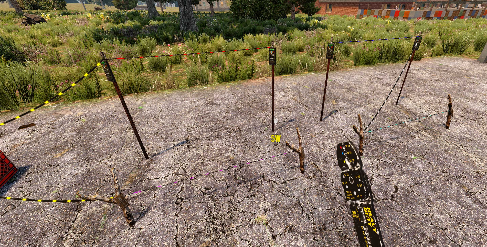

# OCB Electricity Wire Colors Mod - 7 Days to Die (V1.0 exp) Addon

This Mod changes the wire pulse color according to the power state.
It makes it easier to see which part of your cable-mess is missing
a proper connection, or to easier see which items a trigger enables.

This module was broken out of my [Electricity Overhaul Mod][1].  
You can use it standalone or alongside [Electricity Overhaul Mod][1].

[![GitHub CI Compile Status][4]][3]

### Download and Install

End-Users are encouraged to download my mods from [NexusMods][2].  
Every download there helps me to buy stuff for mod development.

Otherwise please use one of the [official releases][5] here.  
Only clone or download the repo if you know what you do!

## Changelog

### Version 1.3.0

- First compatibility with V1.0 (exp)

### Version 1.2.1

- Change mod folder to add OCB prefix

### Version 1.2.0

- Update compatibility for 7D2D A21.0(b324)

## Version 1.0.2

- Fix potential null pointer access in `UpdateWireColor`
- Add gitattributes to force line endings on file types
- Add better compatibility for MSVC solution file
- Automated deployment and release packaging
- Update .NET Target Framework Version to 4.8

## Version 1.0.1

- Fix issue when map is loading with wire tool equipped
- Disable optimization since it seems to fail sometimes

## Version 1.0.0

- Refactor code to be much cleaner and more robust

## Version 0.9.0

- Remove BepInEx requirement (refactored completely)

## Version 0.8.0

- Refactor for A20 compatibility

## Compatibility

Developed initially for version A20(b238), updated through A21.2(b37).

[1]: https://github.com/OCB7D2D/OcbElectricityOverhaul
[2]: https://github.com/OCB7D2D/OcbElectricityWireColors/releases
[3]: https://github.com/OCB7D2D/OcbElectricityWireColors/actions/workflows/ci.yml
[4]: https://github.com/OCB7D2D/OcbElectricityWireColors/actions/workflows/ci.yml/badge.svg
[5]: https://www.nexusmods.com/7daystodie/mods/1720